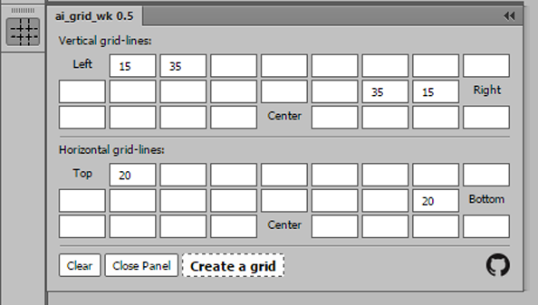
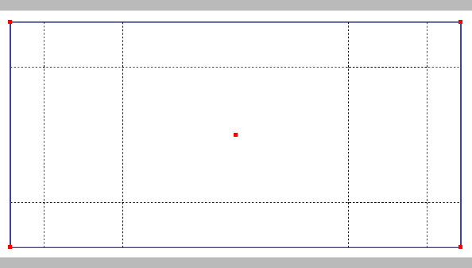

#Add grid-lines inside selected rectangle

##HTML extension panel for Adobe Illustrator

##Description:
* Enter values in the respective fields and click `Create a grid!`.
* Each successive line of a grid is added a **RELATIVELY** the previous one.
* The `Left` and `Top` fields: lines start from the left or top side of the selected object accordingly.
* The `Right` and `Bottom` fields: lines start from the right or bottom side of the selected object accordingly.
 You must enter values in the input fields from right to left.
* The `Center` fields: lines start from the center of the selected object to the both directions of the center accordingly input values.
 You must add value starting from the center to the appropriate side.
* All values in millimeters

[Rus]
##Использование:
* Выделите прямоуголник, внутри которого хотите создать сетку.
* Заполните поля панели и нажмите Create Grid.
* Все значения таблицы относительны.
  Это означает, что каждый следующий размер отсчитывается относительно предыдущего.
* Отсчёт начинается относительно одной из сторон выделенного прямоугольника
( поля Left, Right, Top, Bottom) или относительно его центра (поля Center).

##Порядок заполнения полей таблицы:
* Left/Top заполняются слева направо
* Right/Bottom справа налево
* Center из центра во обе стороны

Толщина линии сетки 0.15 мм, длинна пунктира 0.8 мм. Цвет Black 88.88%.
 Вероятно, скоро появятся настройки, а пока всё просто.